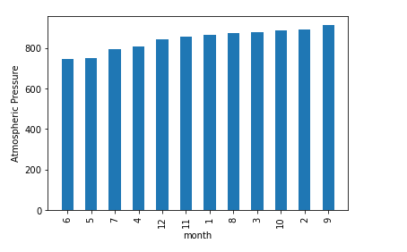

# Mission-to-Mars

## **Overview of Mission to Mars Project**

### To help Robin scrape, organize, analyze, and visualize the data collected from the Mars news articles and weather data.

## **Results**

- **Scraped titles and preview text from Mars news articles and stored the scraped information in the specified Python data structure.**

  <table>
  <tr>
    <td>The Scraped Information</td>
  </tr>
  <tr>
    <td></td>
  </tr>
  </table>
  
- **Scraped and analyzed Mars weather data.**
  
  _**1. How many months exist on Mars?**_
  
    Answer: Please see below.
    
  
  
  _**2. How many Martian days' worth of data are there?**_
  
    Answer: Please see below.
  
  
  
  _**3. Which month, on average, has the lowest temperature? The highest?**_
  
    Answer: On average, the third month has the coldest minimum temperature on Mars, and the eighth month is the warmest. 
  
  
  
  _**4. Which month, on average, has the lowest atmospheric pressure? The highest?**_
  
    Answer: Atmospheric pressure is, on average, lowest in the sixth month and highest in the ninth.
  
  
  
  _**5. How many terrestrial days exist in a Martian year? A visual estimate within 25% was made.**_
  
    Answer: The distance from peak to peak is roughly 1425-750, or 675 days. A year on Mars appears to be about 675 days from the plot. 
    
  
